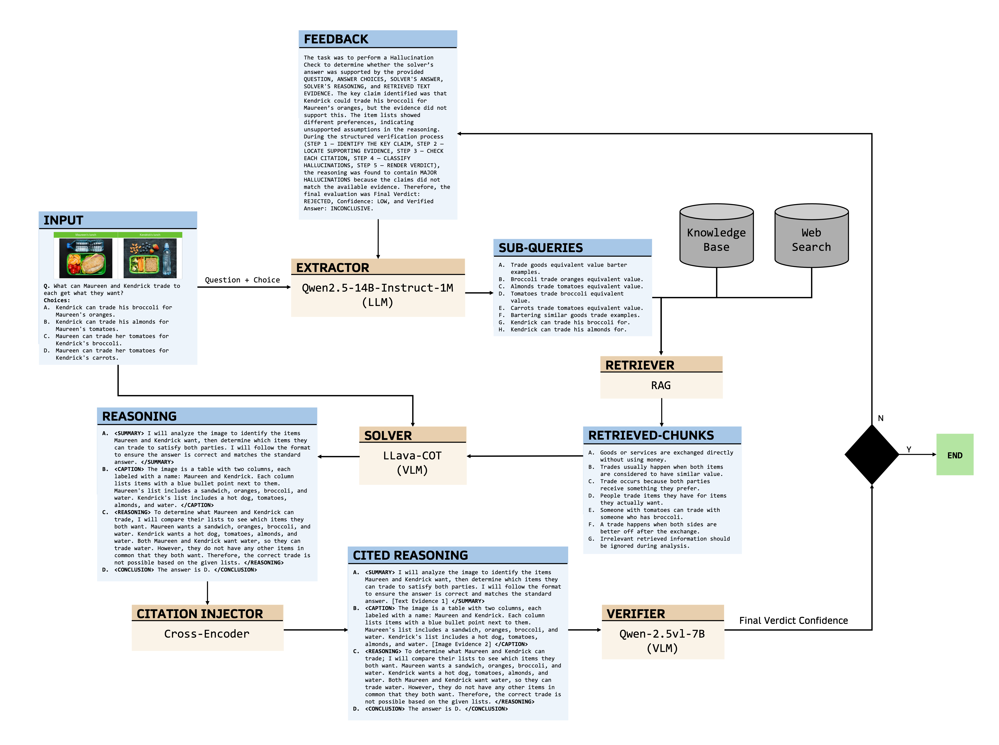

# CaVe-VLM-CoT: An Interpretable Vision-Language Model Framework

A five-stage multi-stage agentic pipeline for grounded multimodal reasoning on science QA. Every answer is backed by cited evidence and verified by a second VLM before being returned — with an automatic feedback loop that retries retrieval when hallucinations are detected.

---

## Architecture
 


Each stage is a node in a **LangGraph** state machine. The shared `State` Pydantic object carries inputs, intermediate outputs, citations, verdicts, and retry history through the entire graph.

---

## Key Features

- **Grounded reasoning** — the solver must cite `[Text Evidence N]` for every text-based claim and `[Question Image N]` for every visual observation. Uncited steps are flagged as hallucinations.
- **Post-hoc citation injection** — a cross-encoder aligns solver claims to retrieved chunks after generation, recovering citations the VLM missed.
- **Two-model verification** — a separate VLM re-reads the evidence and checks each citation in a 5-step chain-of-thought before accepting the answer.
- **Feedback loop** — when the verifier rejects an answer it returns structured feedback (hallucination type, missing evidence, failed queries) that the extractor uses to generate better queries on the next attempt.
- **Multimodal retrieval** — question images are passed directly to both solver and verifier as `[Question Image N]` references; the knowledge base is indexed with `all-MiniLM-L6-v2` (text).
- **Composite scoring** — CaVeScore = `0.4 × accuracy + 0.2 × citation_precision + 0.2 × citation_recall + 0.1 × AIS + 0.1 × grounding_score`.
- **Weight sensitivity analysis** — 7 alternative CaVeScore weight configurations validate that ablation rankings are robust to weight perturbation.


---

## Installation

Requires Python 3.10+ and three A100 GPUs (80 GB each) for the full pipeline, or one A100 for solver-only.

```bash
git clone https://github.com/VectorInstitute/cave-vlm-cot.git
cd cave-vlm-cot/src/cite_verify_vlm_cot

# Create and activate virtual environment
python -m venv env
source env/bin/activate

# Install dependencies
pip install -r requirements.txt
```

### Environment variables

Create a `.env` file in the project root:

```bash
PHOENIX_API_KEY=<your-arize-phoenix-api-key>
PHOENIX_COLLECTOR_ENDPOINT=https://app.phoenix.arize.com
HF_HOME=/path/to/hf_cache
```

---

## Data preparation

Download ScienceQA and run the augmentation script to add image captions, OCR text, and image paths:

```bash
python data-preparation.py
```

This produces `scienceqa_augmented.csv` and the processed image directory. The FAISS text index is built automatically on the first run if not present.

---

## Running experiments

### Ablation configurations

| Task IDs | Pipeline | Description |
|---|---|---|
| 0–4 | `full` | Complete 5-stage pipeline (baseline) |
| 5–9 | `retrieval-solver` | Extractor + Retriever + Solver only |
| 10–14 | `solver-only` | Solver only (no retrieval or verification) |
| 15–19 | `no-citation-injector` | Full pipeline minus Citation Injector |

### Single run (full dataset, sequential)

```bash
python experiments.py --pipeline full
```

### Parallel sharding via SLURM (recommended)

All 4 ablations × 5 shards = 20 tasks submitted as a single array job:

```bash
# Run all experiments
sbatch --array=0-19 --gres=gpu:a100:3 -p a100_b1,a100_b2 cave_array.sh

# Run only solver-only (needs 1 GPU)
sbatch --array=10-14 --gres=gpu:a100:1 -p a100_b1,a100_b2 cave_array.sh
```

### Post-processing (sensitivity analysis + shard aggregation)

After all array tasks complete:

```bash
ARRAY_JOB_ID=$(sbatch --parsable cave_array.sh)
sbatch --dependency=afterok:${ARRAY_JOB_ID} cave_postprocess.sh
```

Or run the sensitivity analysis standalone:

```bash
python sensitivity_analysis.py --results-file outputs/cave_results.json
python sensitivity_analysis.py --smoke-test  # quick sanity check with synthetic data
```

### CLI flags

| Flag | Description |
|---|---|
| `--pipeline` | `full`, `retrieval-solver`, `solver-only`, `no-citation-injector` |
| `--shard N` | 0-based shard index |
| `--num-shards N` | Total shards (default: 1) |
| `--no-traces` | Suppress OpenTelemetry span export (saves Phoenix storage) |

---

## Pipeline components

### 1. Extractor (`planner.py`)

Converts a raw MCQ into up to 8 search queries using **Qwen3-8B** (4-bit via Unsloth). The few-shot prompt ends with `[` to prime the model into producing a structured list. Query quality is enforced by structural validation (`_is_valid_query`) and three-tier parse fallback. On retry, verifier feedback and a list of failed queries are injected into the prompt.

**Guardrails:** structural query validation · 3-way parse fallback · deterministic choice-discriminating queries · keyword-only fallback when LLM output is unparseable · max 8 queries

### 2. Retriever (`retriever.py`)

Per subquery: hybrid local retrieval (dense FAISS + BM25 + RRF fusion), followed by parallel DuckDuckGo web search with choice-augmented variants, then cross-encoder reranking.

**Guardrails:** LRU cache (4,096 entries) on web search · exponential DDG backoff (1 s → 2 s → 4 s) · 0.3 s stagger between parallel DDG submissions · doubled web budget for natural science questions · local docs admitted only when cross-encoder score > 0

### 3. Solver (`solver.py`)

**Llama-3.2V-11B-CoT** (NF4 quantised) generates a structured chain-of-thought with mandatory citation anchors. Two prompt templates: text-only (`SUMMARY → REASONING → CONCLUSION`) and image-present (`OBSERVATIONS → REASONING → CONCLUSION`). A cross-encoder consistency check corrects the stated answer letter if reasoning supports a different choice by a margin > 0.5.

**Guardrails:** structured XML tags enforce output format · mandatory `[Text Evidence N]` and `[Question Image N]` citations · cross-encoder consistency check on conclusion · multi-pattern answer extraction with tail fallback · max 5 question images

### 4. Citation Injector (`citation_injector.py`)

Post-hoc grounding step between solver and verifier. Splits reasoning into claims and uses the cross-encoder (`ms-marco-MiniLM-L-6-v2`) to match each uncited claim to the best evidence chunk (threshold 0.4). Handles domain-knowledge steps by running targeted web search for `"From domain knowledge, <claim>"` sentences.

**Guardrails:** DK enrichment gated on KB coverage (< 2 substantive chunks) · DK lookups capped at 3 per question · min claim length 20 chars · skips if > 50% already cited (unless conclusion is uncited) · observation-block claims skip text matching (image-only evidence)

### 5. Verifier (`verifier.py`)

**Qwen3-VL-8B-Instruct** runs a 5-step structured hallucination check: identify key claim → quote what each cited evidence actually says → check each citation → classify hallucinations → render verdict. Shares the same evidence list as the solver (via `_build_text_chunk_list`) so citation numbers are never misaligned.

**Guardrails:** INCONCLUSIVE-REJECT downgraded to VERIFIED/LOW (verifier is uncertain) · VERIFIED-INCONCLUSIVE recovers solver letter · UNKNOWN verdict fallback · max 4 images · max 3 retry attempts

---

## Evaluation metrics

All 27 evaluators are defined in `evaluations.py` and logged to Arize Phoenix per question.

| Metric | Description |
|---|---|
| `accuracy` | Final answer matches gold label |
| `cave_score` | Composite: `0.4×acc + 0.2×cite_prec + 0.2×cite_rec + 0.1×AIS + 0.1×grounding` |
| `citation_precision` | NLI check: does cited evidence entail the claim? |
| `citation_recall` | Fraction of factual sentences that carry a citation |
| `ais` | Attribution score: fraction of reasoning steps attributable to retrieved evidence |
| `hallucination_rate` | `1 − AIS` |
| `grounding_score` | NLI: does retrieved evidence entail the final answer? |
| `planner_hit` | Retrieved chunks include gold-answer content |
| `planner_coverage` | Fraction of answer choices covered by subqueries |
| `recall@2 / precision@2 / MRR / NDCG@2` | Standard retrieval metrics |
| `qi_citation_coverage` | Fraction of image questions with ≥ 1 `[Question Image N]` citation |
| `qi_citation_precision` | `[Question Image N]` IDs are in-range |
| `decision_correct` | Verifier verdict matches ground-truth hallucination label |

NLI is computed by `cross-encoder/nli-deberta-v3-base`.

---

## GPU allocation

| GPU | Model | VRAM |
|---|---|---|
| `cuda:0` | Qwen3-8B extractor (4-bit via Unsloth) + cross-encoder + SentenceTransformer | ~8 GB |
| `cuda:1` | Llama-3.2V-11B-CoT solver (NF4) | ~22 GB |
| `cuda:2` | Qwen3-VL-8B-Instruct verifier | ~17 GB |

For solver-only runs, the solver loads on `cuda:0` and only 1 GPU is needed.

---

## Weight sensitivity analysis

CaVeScore rankings are validated under 7 alternative weight configurations:

| Config | w_acc | w_cprec | w_crec | w_ais | w_gnd |
|---|---|---|---|---|---|
| default | 0.40 | 0.20 | 0.20 | 0.10 | 0.10 |
| accuracy_heavy | 0.60 | 0.10 | 0.10 | 0.10 | 0.10 |
| citation_heavy | 0.20 | 0.30 | 0.30 | 0.10 | 0.10 |
| uniform | 0.20 | 0.20 | 0.20 | 0.20 | 0.20 |
| ais_heavy | 0.30 | 0.15 | 0.15 | 0.25 | 0.15 |
| grounding_heavy | 0.30 | 0.15 | 0.15 | 0.15 | 0.25 |
| recall_skewed | 0.35 | 0.10 | 0.35 | 0.10 | 0.10 |

No re-inference required — pure arithmetic re-weighting of pre-computed components.

---

## Observability

All pipeline stages emit OpenTelemetry spans to Arize Phoenix via `BatchSpanProcessor`. Traced attributes include `planner.coverage_score`, `retriever.recall`, `verifier.verdict`, `verifier.hallucination_count`, and token counts for every LLM call. Use `--no-traces` to suppress span export on large runs while still recording experiment results.

---
## Project structure

```
cave-vlm-cot/
├── src/cite_verify_vlm_cot/
│   ├── experiments.py              # Main experiment runner
│   ├── evaluations.py              # 27 evaluation metrics
│   ├── sensitivity_analysis.py     # Weight sensitivity analysis (Experiment 4)
│   ├── utils.py                    # State, indexing, helpers
│   ├── extractor/
│   │   └── planner.py              # Qwen3-8B query decomposition
│   ├── retriever/
│   │   └── retriever.py            # Hybrid BM25 + FAISS + web search
│   ├── solver/
│   │   ├── solver.py               # Llama-3.2V-11B reasoning
│   │   ├── solver_evals.py         # CaVeScore, WEIGHT_CONFIGS
│   │   └── citation_injector.py    # Post-hoc citation grounding
│   ├── verifier/
│   │   └── verifier.py             # Qwen3-VL-8B verification + graph builders
│   └── batch_files/
│       ├── cave_array.sh           # SLURM array job (20 tasks)
│       ├── cave_postprocess.sh     # Shard aggregation + sensitivity
│       └── cave_test.sh            # Single-sample smoke test
```
---
## Citation

```bibtex
@article{rao2026cave,
  title={CaVe-VLM-CoT: An Interpretable Vision-Language Model Framework},
  author={Rao, Sneha and Raza, Shaina and Ramachandram, Dhanesh},
  year={2026}
}
```
---
## Useful resources

https://medium.com/kx-systems/guide-to-multimodal-rag-for-images-and-text-10dab36e3117 (Method 2)

https://blog.roboflow.com/image-search-engine-gaudi2/

https://cookbook.openai.com/examples/custom_image_embedding_search

https://medium.com/@rossashman/the-art-of-rag-part-3-reranking-with-cross-encoders-688a16b64669

https://medium.com/@aishikbhattacharjee98/reranking-using-cross-encoder-boost-your-rag-pipeline-accuracy-d2da22006dad

https://medium.com/@abheshith7/mastering-reranking-in-rag-from-basic-retrieval-to-advanced-methods-db297530361a

https://huggingface.co/Qwen/Qwen2.5-VL-7B-Instruct 
