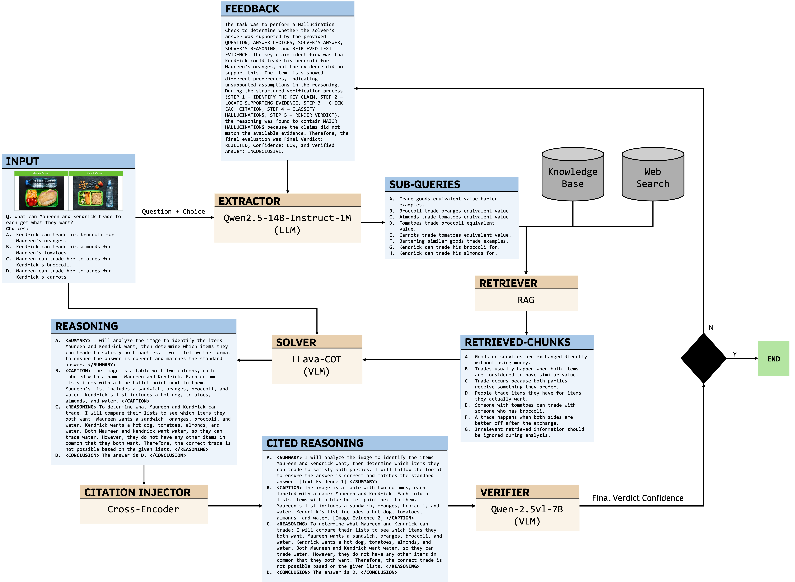

# CaVe-VLM-CoT: Cite-and-Verify Vision-Language Model with Chain-of-Thought

A five-stage agentic RAG pipeline for grounded multimodal reasoning on science QA. Every answer is backed by cited evidence and verified by a second VLM before being returned — with an automatic feedback loop that retries retrieval when hallucinations are detected.

---

## Architecture
 


Each stage is a node in a **LangGraph** state machine. The shared `State` Pydantic object carries inputs, intermediate outputs, citations, verdicts, and retry history through the entire graph.

---

## Key Features

- **Grounded reasoning** — the solver must cite `[Text Evidence N]` for every text-based claim and `[Question Image N]` for every visual observation. Uncited steps are flagged as hallucinations.
- **Post-hoc citation injection** — a cross-encoder aligns solver claims to retrieved chunks after generation, recovering citations the VLM missed.
- **Two-model verification** — a separate VLM re-reads the evidence and checks each citation in a 5-step chain-of-thought before accepting the answer.
- **Feedback loop** — when the verifier rejects an answer it returns structured feedback (hallucination type, missing evidence, failed queries) that the planner uses to generate better queries on the next attempt.
- **Multimodal retrieval** — question images are passed directly to both solver and verifier as `[Question Image N]` references; the knowledge base is indexed with `all-MiniLM-L6-v2` (text) and CLIP (images).
- **Composite scoring** — CaVeScore = `0.4 × accuracy + 0.2 × citation_precision + 0.2 × citation_recall + 0.1 × AIS + 0.1 × grounding_score`.

---

## Installation

Requires Python 3.10+ and three A100 GPUs (80 GB each).

```bash
git clone https://github.com/VectorInstitute/cave-vlm-cot.git
cd cave-vlm-cot/src/cite_verify_vlm_cot

# Create and activate virtual environment
python -m venv fresh_env
source fresh_env/bin/activate

# Install dependencies
pip install -r requirements.txt
```

### Environment variables

Create a `.env` file in the project root:

```bash
PHOENIX_API_KEY=<your-arize-phoenix-api-key>
PHOENIX_COLLECTOR_ENDPOINT=https://app.phoenix.arize.com/s/CaVe-VLM-CoT
HF_HOME=/path/to/hf_cache
```

---

## Data preparation

Download ScienceQA and run the augmentation script to add image captions, OCR text, and image paths:

```bash
python data-preparation.py
```

This produces `scienceqa_augmented.csv` and the processed image directory. Then build the FAISS text index:

```bash
python -c "from utils import build_full_image_indexes; build_full_image_indexes()"
```

This writes `text_index.faiss`, `full_image_index.faiss`, `image_metadata.pkl`, and `multimodal_embeddings.csv`.

---

## Running experiments

### Single GPU (full dataset, sequential)

```bash
python experiments.py
```

### Parallel sharding across 3 GPUs (recommended)

Submit as a SLURM array job — each task owns 3 A100s and processes one third of the dataset:

```bash
sbatch cave_array.sh
```

Each shard writes results to a separate Phoenix experiment named `CaVe-VLM-CoT-v1-shard{N}-of-3`.

### Aggregating shard results

Export the CSV from each shard experiment in the Phoenix UI, then:

```bash
python aggregate_shards.py shard0.csv shard1.csv shard2.csv

# Save combined per-row CSV for further analysis
python aggregate_shards.py shard0.csv shard1.csv shard2.csv --save-csv combined.csv
```

---

## Pipeline components

### 1. Planner (`planner.py`)

Converts a raw MCQ into up to 8 search queries using **Qwen2.5-7B-Instruct** (4-bit). The few-shot prompt ends with `[` to prime the model into producing a JSON array. Query quality is enforced by structural validation (`_is_valid_query`) and three-tier parse fallback. On retry, verifier feedback and a list of failed queries are injected into the prompt.

**Guardrails:** structural query validation · 3-way JSON parse fallback · deterministic choice-discriminating queries · keyword-only fallback when LLM output is unparseable · max 8 queries

### 2. Retriever (`retriever.py`)

Per subquery: hybrid local retrieval (dense FAISS + BM25 + RRF fusion) over up to 3 query paraphrases, followed by parallel DuckDuckGo web search with choice-augmented variants, then cross-encoder reranking.

**Guardrails:** LRU cache (4,096 entries) on web search · exponential DDG backoff (1 s → 2 s → 4 s) · 0.3 s stagger between parallel DDG submissions · doubled web budget for natural science questions · local docs admitted only when cross-encoder score > 0

### 3. Solver (`solver.py`)

**Llama-3.2V-11B** generates a structured chain-of-thought with mandatory citation anchors. Two prompt templates: text-only (`SUMMARY → REASONING → CONCLUSION`) and image-present (`OBSERVATIONS → REASONING → CONCLUSION`). A cross-encoder consistency check corrects the stated answer letter if reasoning supports a different choice by a margin > 0.5.

**Guardrails:** structured XML tags enforce output format · mandatory `[Text Evidence N]` and `[Question Image N]` citations · cross-encoder consistency check on conclusion · multi-pattern answer extraction with tail fallback · max 5 question images

### 4. Citation Injector (`citation_injector.py`)

Post-hoc grounding step between solver and verifier. Splits reasoning into claims and uses the cross-encoder (`ms-marco-MiniLM-L-6-v2`) to match each uncited claim to the best evidence chunk (threshold 0.5). Handles domain-knowledge steps by running targeted web search for `"From domain knowledge, <claim>"` sentences and storing snippets under `dk_web_N` keys.

**Guardrails:** DK enrichment gated on KB coverage (< 2 substantive chunks) · DK lookups capped at 3 per question · min claim length 20 chars · skips if > 50% already cited (unless conclusion is uncited) · observation-block claims skip text matching (image-only evidence)

### 5. Verifier (`verifier.py`)

**Qwen2.5-VL-7B** runs a 5-step structured hallucination check: identify key claim → quote what each cited evidence actually says → check each citation → classify hallucinations → render verdict. Shares the same evidence list as the solver (via `_build_text_chunk_list`) so citation numbers are never misaligned.

**Guardrails:** INCONCLUSIVE-REJECT downgraded to VERIFIED/LOW (verifier is uncertain) · VERIFIED-INCONCLUSIVE recovers solver letter · UNKNOWN verdict fallback · max 4 images · verifier skipped for text-only questions with ≥ 2 citations (auto-VERIFIED) · max 3 retry attempts

---

## Evaluation metrics

All 27 evaluators are defined in `evaluations.py` and logged to Arize Phoenix per question.

| Metric | Description |
|---|---|
| `accuracy` | Final answer matches gold label |
| `cave_score` | Composite: `0.4×acc + 0.2×cite_prec + 0.2×cite_rec + 0.1×AIS + 0.1×grounding` |
| `citation_precision` | NLI check: does cited evidence entail the claim? |
| `citation_recall` | Fraction of factual sentences that carry a citation |
| `ais` | Attribution score: fraction of reasoning steps attributable to retrieved evidence |
| `hallucination_rate` | `1 − AIS` |
| `grounding_score` | NLI: does retrieved evidence entail the final answer? |
| `planner_hit` | Retrieved chunks include gold-answer content |
| `planner_coverage` | Fraction of answer choices covered by subqueries |
| `recall@2 / precision@2 / MRR / NDCG@2` | Standard retrieval metrics |
| `qi_citation_coverage` | Fraction of image questions with ≥ 1 `[Question Image N]` citation |
| `qi_citation_precision` | `[Question Image N]` IDs are in-range |
| `decision_correct` | Verifier verdict matches ground-truth hallucination label |

NLI is computed by `cross-encoder/nli-deberta-v3-base`.

---

## GPU allocation

| GPU | Model | VRAM |
|---|---|---|
| `cuda:0` | Qwen2.5-7B planner (4-bit) + cross-encoder + SentenceTransformer | ~6 GB |
| `cuda:1` | Llama-3.2V-11B solver | ~22 GB |
| `cuda:2` | Qwen2.5-VL-7B verifier | ~15 GB |

---

## Observability

All pipeline stages emit OpenTelemetry spans to Arize Phoenix via `BatchSpanProcessor`. Traced attributes include `planner.coverage_score`, `retriever.recall`, `verifier.verdict`, `verifier.hallucination_count`, and token counts for every LLM call. The Phoenix project is `cite-and-verify-vlm-cot-agent`.

---

## Results (n = 5,000, ScienceQA)

| Metric | Score |
|---|---|
| Accuracy | 0.775 |
| CaVeScore | 0.662 |
| Citation precision | 0.676 |
| Citation recall | 0.626 |
| AIS | 0.619 |
| Hallucination rate | 0.381 |
| Planner hit rate | 0.632 |
<!-- | QI citation coverage | 0.797 | -->
